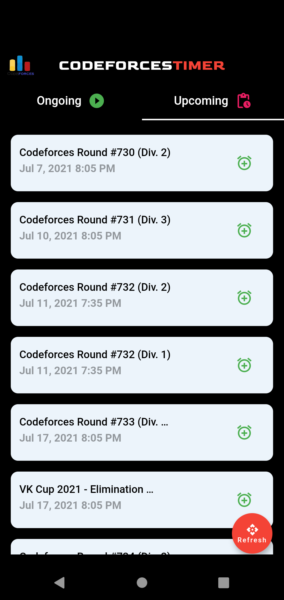

## Codeforces Timer
| Splash | Homepage
|-----------------------------------------------------------------------------------------------------------------------------|-------------------------------------

| |  |

# Show some :heart: and star the repo to support the project.

## Contribute
1. Fork the the project
2. Make required changes and commit (git commit -am 'Add some feature')
3. Push to the main branch
4. Create new Pull Request

### Created & Maintained By

[Subhojeet Sahoo](https://github.com/Alpha17-2)     ([Follow me on Instagram](https://www.instagram.com/alpha__77__/))
